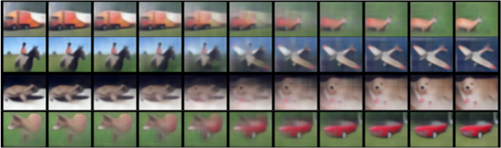

# Manifold_mixup
This repo consists Pytorch code for the paper Manifold Mixup: Encouraging Meaningful
On-Manifold Interpolation as a Regularizer (https://arxiv.org/abs/1806.05236)

The goal of our proposed algorithm, Manifold Mixup, is to increase the generality and effectiveness
of data augmentation by using a deep network’s learned representations as a way of generating novel
data points for training. Some real examples of this kind of interpolation from our model are seen in below figure. The left-most and right-most images are the real images and in-between images are the images interpolated by our method. Please refer to Figure 4 of our [paper](https://arxiv.org/abs/1806.05236) for more details on the below figure.

<p align="center">
    
</p>

The repo consist of three subfolders for Supervised Learning, Semi-Supervised Learning and GAN experiments. Each subfolder is self-contained (can be used independently of the other subfolders). Each subfolder has its own instruction on "How to run" in its README.md file.

If you find this work useful and use it on your own research, please cite our [paper](https://arxiv.org/abs/1806.05236). 

```
@article{manifold_mixup,
  title={Manifold Mixup: Encouraging Meaningful On-Manifold Interpolation as a Regularizer},
  author={Verma, Vikas and Lamb, Alex and Beckham, Christopher and Courville, Aaron  and  Mitliagkis, Ioannis and Bengio, Yoshua},
  journal={arXiv preprint arXiv:1806.05236v1},
  year={2018}
}
```

