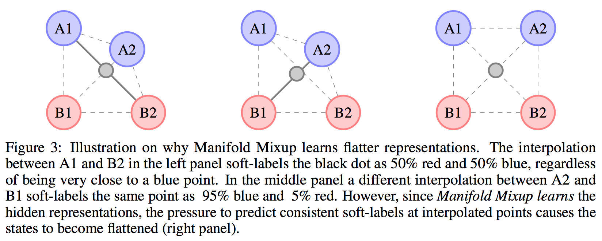

# Manifold_mixup (ICML 2019)
This repo consists Pytorch code for the ICML 2019 paper Manifold Mixup: Better Representations by Interpolating Hidden States (https://arxiv.org/abs/1806.05236 ICML version (http://proceedings.mlr.press/v97/verma19a.html))

The goal of our proposed algorithm, Manifold Mixup, is to learn robust features by interpolating the hidden states of examples. The representations learned by our method are more discriminative and compact as shown in the below figure.  Please refer to Figure 1 and Figure 2 of our [paper](https://arxiv.org/abs/1806.05236) for more details.

<p align="center">
    
</p>

<p align="center">
    
</p>

The repo consist of two subfolders for Supervised Learning and GAN experiments. Each subfolder is self-contained (can be used independently of the other subfolders). Each subfolder has its own instruction on "How to run" in its README.md file.

If you find this work useful and use it on your own research, please concider citing our [paper](http://proceedings.mlr.press/v97/verma19a.html). 

```
@InProceedings{pmlr-v97-verma19a,
  title = 	 {Manifold Mixup: Better Representations by Interpolating Hidden States},
  author = 	 {Verma, Vikas and Lamb, Alex and Beckham, Christopher and Najafi, Amir and Mitliagkas, Ioannis and Lopez-Paz, David and Bengio, Yoshua},
  booktitle = 	 {Proceedings of the 36th International Conference on Machine Learning},
  pages = 	 {6438--6447},
  year = 	 {2019},
  editor = 	 {Chaudhuri, Kamalika and Salakhutdinov, Ruslan},
  volume = 	 {97},
  series = 	 {Proceedings of Machine Learning Research},
  address = 	 {Long Beach, California, USA},
  month = 	 {09--15 Jun},
  publisher = 	 {PMLR},
  pdf = 	 {http://proceedings.mlr.press/v97/verma19a/verma19a.pdf},
  url = 	 {http://proceedings.mlr.press/v97/verma19a.html},
  }


```
Note: Please refer to our new repo for Interpolation based Semi-supervised Learning https://github.com/vikasverma1077/ICT

